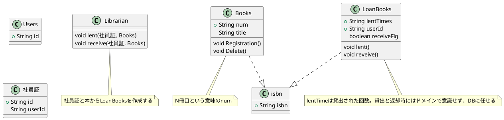

Feature: 貸出
Scenario: 水上が実践DDDの本と社員証を司書に渡して借りる
GIVEN: 水上が本棚から実践DDDを持ってくる
WHEN: 水上が実践DDDの本と社員証を司書に渡す
WHEN: 司書が社員証と実践DDDの本から貸出帳に追記する
THEN: 水上が本を借りる

Scenario: 司書を通さずに返却された本を借りる
GIVEN: 実践DDDの本は本棚に3冊あるが、貸出帳上は3冊とも借りられている
GIVEN: 水上が本棚から実践DDDを持ってくる
WHEN: 水上が実践DDDの本と社員証を司書に渡す
WHEN: 司書が社員証と実践DDDの本から貸出帳に追記する
WHEN: 本と貸出帳が一致しないので管理者に連絡する
THEN: 水上が本を借りる

Feature: 返却
Scenario: 本を1冊借りる
GIVEN: 水上は実践DDDの本を1冊だけ借りている
WHEN: 水上が実践DDDの本と社員証を司書に渡す
WHEN: 司書が水上が借りた実践DDDの貸出帳に返却済と更新する
THEN: 水上が本を返す

Scenario: 同じ本を複数借りる
GIVEN: 水上は実践DDDの本を3冊借りている
WHEN: 水上が実践DDDの本を1冊と社員証を司書に渡す
WHEN: 司書が水上が借りた実践DDDの貸出帳の貸出回数が一番小さい番号を返却済と更新する
THEN: 水上が本を返す
THEN: 水上は実践DDDの本を2冊借りている

Feature: 管理
Scenario: 司書が実践DDDが無くなっていないか確認する
WHEN: 司書が実践DDDの本を本棚から数える
WHEN: 司書が実践DDDの貸出帳から未返却の数を数える
THEN: 司書が実践DDDの数があっているかを確認する

BooksRestController.javaのエンドポイントは
/books/ PUTは登録、DELETEは削除
/books/borrow 貸出
/books/return 返却 

管理のエンドポイントは
/manage/books
?

