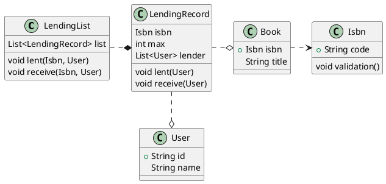

```puml
@startuml
class LendingList {
  List<LendingRecord> list

  void lent(Isbn, User)
  void receive(Isbn, User)
}
LendingList .* LendingRecord

class LendingRecord {
  Isbn isbn
  int max
  List<User> lender

  void lent(User)
  void receive(User)
}
LendingRecord .o  Book
LendingRecord ..o User

class Book {
  + Isbn isbn
  String title
}
Book .> Isbn

class User{
  + String id
  String name
}

class Isbn {
  + String code
  void validation()
}
@enduml
```
