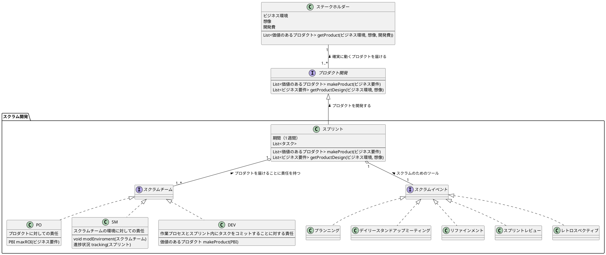

スクラムチーム
SM
PO
DEV
ステークホルダー

スクラムイベント
スプリント
プランニング
デイリースタンドアップミーティング
リファインメント
スプリントレビュー
レトロスペクティブ

スクラムについて
スクラムはステークホルダーに早くプロダクトを提供するための開発手法

プロダクトは1週間程度の短いスパンで確実に動くプロダクトを繰り返し届ける

ステークホルダーの事業環境の変化に柔軟に対応し、その時に最適なプロダクトを届ける

各ロールについて
PO
プロダクトの内容に責任を持つ

SM
スクラムチームの環境に責任を持つ

DEV
作業プロセスとスプリント内にタスクをコミットすることに責任を持つ

